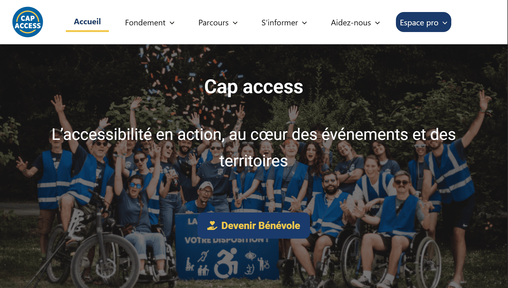
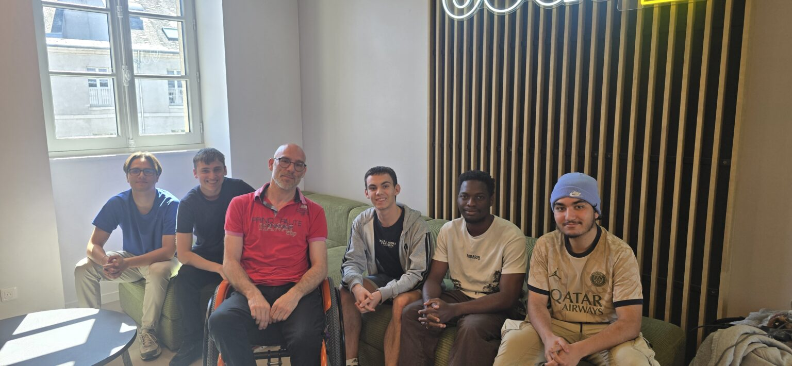

# Salut, moi c'est Tevaitea 👋

**Étudiant développeur Full-Stack** en 2ᵉ année de Bachelor à **CODA Orléans** (diplôme prévu en 2027).

🎯 **Je recherche une alternance**, disponible dès maintenant, au rythme de **3 semaines en entreprise / 1 semaine à l'école**.

J'aime construire des applications de bout en bout, de la base de données jusqu'à l'interface, en faisant attention à la structure et à la qualité du code.

---

### 🛠️ Ma stack

- **Front-end :** HTML5 · CSS3 · JavaScript · React · Vue.js · WordPress
- **Back-end :** PHP · Python · Java · Node.js / Express · POO
- **Données & outils :** SQL · MySQL · Git · Docker · Linux / Shell

---

### 🚀 Mes projets

#### ♿ [CapAccess](https://capaccess.fr/) · projet académique en équipe 🏆
Plateforme web inclusive développée pour une entreprise spécialisée dans l'accompagnement des personnes en situation de handicap. Réalisée en **3 semaines** dans un contexte professionnel simulé, elle combine une **vitrine publique**, un **blog** et un **espace professionnel sécurisé** avec gestion des rôles et accès différencié aux ressources.

J'ai participé à l'analyse des besoins, à la conception, au développement, aux tests et à la livraison finale. **Le projet a été récompensé comme l'un des meilleurs parmi les équipes participantes.**

**Stack :** WordPress · PHP · Figma

> ℹ️ Le site [capaccess.fr](https://capaccess.fr/) n'est plus maintenu par notre équipe depuis la fin du projet.

*L'équipe du projet CapAccess*

#### 🦷 [StudioDontho](https://github.com/DoomTevaitea/studiodontho)
Application web éducative *mobile-first* dans le domaine dentaire : cours, quiz, classement et progression sauvegardée, avec un mode découverte et un mode professionnel.

**Stack :** HTML/CSS · JavaScript · Node.js / Express · MySQL · Docker · mots de passe hachés (bcrypt) · sessions en base

#### ⚔️ [JsArena](https://github.com/DoomTevaitea/Js-Arena)
Jeu de bataille multijoueur en temps réel où plusieurs joueurs s'affrontent dans une arène.

**Stack :** Python (logique serveur) · JavaScript (interface dans le navigateur)

#### 🌾 [Farm Simulator](https://github.com/DoomTevaitea/Projet-JAVAFX-farm-simulator)
Jeu de gestion de ferme : achat de terrains, cultures, élevage, inventaire, boutique, météo et sauvegarde de la partie.

**Stack :** Java · JavaFX · POO

#### 🍔 Roblox Street Food
Jeu Roblox de gestion de food truck : développement client-serveur, interface utilisateur et Rojo.

**Stack :** Luau · Roblox Studio

---

### 📚 En ce moment

- J'approfondis les **design patterns** et le **clean code** en PHP (refactoring, tests unitaires, documentation de conception).
- Je continue à développer des jeux et des applications web sur mon temps libre.

---

### 📫 Me contacter

- 🌐 **Portfolio :** [doomtevaitea.github.io](https://doomtevaitea.github.io)
- ✉️ **Mail :** tevaitea.doom@codastudent.school
- 📍 Orléans et alentours · Permis B, véhiculé
